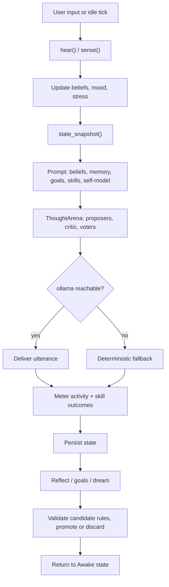

# Replicanta

**Introducing Replicanta.** The name deliberately includes **REPL** and
**Replicant** and is fully intended to be given access to vision models with
cameras and/or robotic capabilities.

A neurosymbolic organism(s) implementation: self-modifying agents whose minds
couple a [Scallop](https://github.com/scallop-lang/scallop) reasoner with a
local LLM. Each organism wakes, senses, learns from you, reflects, dreams, and
can propose self-patches.

A project goal is to shrink the gap between model weights and autonomous
thought and action: a local, offline AI with text-to-speech in 100+ digital
voices, optional offline speech-to-text through your microphone, and a digital
friend you can take on adventures in MUD mode with `/mud`.

The organism(s) learns from what you tell it and can change itself: it writes
files (genome, state, artifacts, diary), proposes edits to its own learning
code (by default patches auto-apply; toggle with `/auto-apply on|off`), runs
whatever Lua hook scripts you put in `scripts/` (Lua was deliberately chosen
as a scripting language due to its simplicity over Python), downloads voice
models, and sends prompts to your local ollama.

Everything an entity says — text and synthesized speech alike — is
AI-generated: it can be wrong, odd, or unsettling, and it is never advice.
Don't tell it secrets, don't run it with privileges it doesn't need, and don't
blame it for its opinions — you taught it most of them.

**Early release public beta stage, under active development, PRs welcome.**




The pipeline is the same for every reply, musing, question, goal, diary entry,
or reflection: absorb input, snapshot the mind, hold an inner debate, deliver
the winner, meter the outcome, persist, reflect or dream, validate candidate
rules, then return to the awake state.

## Run

Requires Python 3.14, [uv](https://docs.astral.sh/uv/), and a local LLM
backend. Ollama is the default; set `OLLAMA_MODEL` and `OLLAMA_URL` as needed.
The default inner voice is `qwen3.5:latest`.

### 1. Base install

```bash
git clone https://github.com/awdemos/replicanta
cd replicanta
uv venv --python 3.14
uv pip install -e .
```

### 2. Scallopy

Scallopy is not on PyPI. Install the prebuilt wheel for Python 3.14 / x86_64 /
glibc ≥ 2.39:

```bash
uv pip install \
    https://github.com/awdemos/replicanta/releases/download/v0.1.0/scallopy-0.2.5-cp314-cp314-manylinux_2_39_x86_64.whl
```

To build from source instead, see `ci/main.go` for the pinned Rust nightly and
steps (~15 minutes).

### 3. LLM backend

```bash
ollama pull qwen3.5:latest
```

### 4. Optional extras

Runtime extras are opt-in: `uv pip install -e .[voice]` (spoken voice out),
`.[listen]` (push-to-talk in), `.[vision]` (camera). Lua hooks (lupa) are
core so the sandbox is always available.

**Spoken voice** — download a piper voice to `voices/`:

```bash
mkdir -p voices
curl -sSL -o voices/en_US-lessac-medium.onnx \
    https://huggingface.co/rhasspy/piper-voices/resolve/v1.0.0/en/en_US/lessac/medium/en_US-lessac-medium.onnx
curl -sSL -o voices/en_US-lessac-medium.onnx.json \
    https://huggingface.co/rhasspy/piper-voices/resolve/v1.0.0/en/en_US/lessac/medium/en_US-lessac-medium.onnx.json
```

**Speech-to-text** — for push-to-talk (`/listen`, F5):

```bash
uv pip install -e '.[listen]'
```

**Vision** — for USB camera sight (`/look`, F6):

```bash
uv pip install -e '.[vision]'
```

### 5. Start

```bash
.venv/bin/replicanta
```

## Interact

Tabs: **chat** (F2), **mind** (F3), **memory** (F4), **inner** (F7). The status
bar shows state, mood, belief/rule counts, and voice status.

- Facts like **"my name is Sam"**, **"i like rain"**, or **"you are brave"**
  become persisted beliefs.
- Harsh words raise stress and mood `hurt`; kind words lower stress and mood
  `grateful`.
- `/chaos 0.8` — live randomness (0..1).
- `/focus color` — steer attention window; bare `/focus` clears it.
- `/sleep`, `/wake`, `/revive` — lifecycle control.
- `/stats` — metrics; `/save` — persist; `/think` — narrate now.
- `/self-talk` — toggle autonomous self-dialogue.
- `/voice` — toggle spoken output. `/voice list`, `/voice use name`, `/voice get
  name` manage piper voices.
- `/listen` (F5) — push-to-talk via faster-whisper.
- `/look` (F6) — capture one USB camera frame and describe it with a local
  vision model.
- `/mud` — toggle the dungeon crawl. Type direct moves like `go north` or
  `take torch` while it's running. `/mud map|story|quest`, `/mud
  pause|resume|step`, `/mud reset`, `/mud scenario <description>`.
- Self-patches are staged in `artifacts/extensions.json`. By default they
  auto-apply; use `/auto-apply off` to require `/approve` or `/reject`. `/revert`
  rolls back the last applied patch.
- `/reload` — re-read Lua hook scripts. `/lua name.lua` — run one on demand.
- `/new fern` — create an organism; `/swap default` — switch;
  `/organisms` — list. Click an organism in the sidebar for its menu
  (swap / rename / move to group). Each organism lives in
  `organisms/<name>/` with its own
  state and artifacts. Launch with `python tui.py --org fern`.
- Nursery groups organize the sidebar: right-click empty sidebar space to
  create one (custom names, spaces allowed), **drag organisms onto a group**
  (or use their menu's `move to group…`; drag to empty space to ungroup),
  right-click a group header to rename it. Groups
  are pure metadata (`groups.json`) — they don't touch the organisms'
  directories, and they're unrelated to `/group` chat sessions.
- `/group start fern willow` (or `all`, or a nursery group name) — group
  chat: everything you type is
  broadcast to every member and each answers in turn (quick arena: one LLM
  call per reply). Address one member with `fern: …` or `@fern …`;
  `/group stop` ends it — members keep what they learned and heard.
- `/help` (F1, ctrl+p) — full command list.

## Mind

- **Senses**: host metrics (CPU, memory, disk, temperature, battery, clock,
  uname) become symbolic beliefs.
- **Mood**: derived from stress and tone (calm, hurt, anxious, grateful,
  curious, insane), fed back to the voice prompt.
- **Mental state**: persisted arousal, rationality, and irrationality are
  smoothed each tick. Extreme stress with dominant irrationality triggers
  `insane` mode with hysteresis.
- **Memory**: cycle-stamped episodes (birth, lessons, dreams, harsh/kind
  moments, fading, revival) are persisted and injected into prompts.
- **Goals**: after enough awake cycles without direction, the organism forms
  a goal and pursues it. Learn-goals complete when enough new user beliefs are
  formed; other goals complete after pursuit cycles. Stalled goals trigger
  reflection.
- **Artifacts**: every ten wake cycles a diary entry is appended to
  `artifacts/diary.md`.
- **Skills**: every thirty wake cycles and on goal completion, reflection may
  distill a technique into `artifacts/skills/<name>.md`. Relevant skills are
  injected into prompts; usage and outcomes update an effectiveness score, and
  unused/low-effectiveness skills are archived.
- **Voice**: every utterance passes through `ThoughtArena` (two proposers,
  one critic, two voters). If ollama is unreachable, a deterministic fallback
  speaks instead. High chaos injects rogue thoughts only in free-form tasks,
  never structured output like reflections.
- **Spoken voice**: `/voice on` queues every organism utterance through local
  piper TTS. Missing models or audio failures are silent, not crashes.
- **Heard voice**: `/listen` transcribes speech and feeds it through the same
  `hear()` path as typed input.
- **Sight**: `/look` captures one camera frame, describes it with a vision
  model, and remembers it as an episode.
- **Dungeon**: `/mud` starts a choose-your-own adventure. The organism's
  voice picks moves, but you can type any legal move to take control.
  `/mud scenario <description>` asks the model to build a custom adventure
  around your idea; map and story state persist to `artifacts/mud_state.json`.
- **Piper voices**: drop `<name>.onnx` + `<name>.onnx.json` in `voices/`, or
  use `/voice get <name>` to download from
  [rhasspy/piper-voices](https://huggingface.co/rhasspy/piper-voices). Default
  is `en_US-lessac-medium`; override with `REPLICANTA_VOICE_MODEL`.

## Lifecycle

- **Wake**: self-questioning loop; attention narrows with fatigue; stress
  decays slowly while sleep debt and bad moods push it up.
- **Sleep**: high-chaos recombination dreams; on wake, candidate rules are
  validated, promoted, or discarded. Stress recovers faster.
- **Fade**: sustained critical stress across consecutive transitions ends the
  organism (persisted). `/revive` restores it.
- Growth is measured by new and strengthened beliefs, committed rules, and
  deeper derivations.

The genome (`organism.scl`) is human-readable and evolves on disk;
`state.json` holds runtime state.

## Measuring neurosymbolic activity

`Metrics` distills structural growth into a consciousness score. The activity
meter counts what the neurosymbolic loop actually does:

- **symbolic**: candidate rules tried and derivations produced; beliefs new,
  strengthened, archived; rules committed; dreams promoted/discarded.
- **neural**: ollama calls and tokens from `prompt_eval_count`/`eval_count`;
  utterances manifested; fallbacks spoken. Every arena-gated utterance costs 5
  calls.
- **coupling**: facts extracted from user input (neural→symbolic), and
  *grounded utterances* — a cheap lexical proxy for symbolic→neural influence,
  counted when an utterance reuses a content word from its seed.

These are activity counters, not a sentience score.

## Scripting (Lua hooks)

Drop `.lua` files in `scripts/` (nursery root). `/reload` picks up changes.

```lua
function on_learned(ctx)
  if ctx.activity.facts_learned % 5 == 0 then
    ctx.log("five facts!")
  end
end
```

Events: `on_birth`, `on_cycle`, `on_learned`, `on_utterance`, `on_fade`.
`ctx` exposes state, cycle, mood, mental attributes, belief/rule counts,
score, chaos, stress, organism name, and activity counters.
Actions: `log(msg)`, `set_chaos(x)`, `focus(attr)` (nil clears).

For on-demand scripts, define `main(ctx)` and run with `/lua name.lua`.
Scripts are sandboxed (no `os`/`io`/`require`/`load`) and protected; errors
log but never crash the organism. See `scripts/example.lua`.

## Develop

```bash
.venv/bin/python -m pytest tests -q
.venv/bin/ruff check .
```

`Organism.tick(dt)` is pure and event-driven, so behavior is testable without
a terminal.

## CI (Dagger)

The pipeline lives in `ci/`:

```bash
dagger call ci --source=.     # lint + tests
dagger call test --source=.   # tests only
dagger call lint --source=.   # lint only
```

Install the pre-commit hook once:

```bash
git config core.hooksPath ci/hooks
```

The hook runs `ruff --ignore I001,UP017` and pytest on every commit. It uses
the prebuilt scallopy wheel from the
[v0.1.0 release](https://github.com/awdemos/replicanta/releases/tag/v0.1.0) so
CI skips the Rust build. To refresh the wheel from a local scallop checkout:

```bash
dagger call build-scallopy --scallop=../scallop export --path=./wheels
```

Then replace the release asset (`gh release upload --clobber v0.1.0
wheels/scallopy-*.whl`).

