<p align="center">
  
</p>

<h1 align="center">Replicanta</h1>

<p align="center">
  <strong>A local, neurosymbolic AI companion.</strong><br>
  Scallop reasoner · local LLM · self-modifying agents · voice · vision · MUD
</p>

<p align="center">
  <code>Early release public beta</code> · PRs welcome
</p>

---

**Replicanta** is a self-modifying digital organism that couples a
[Scallop](https://github.com/scallop-lang/scallop) symbolic reasoner with a
local LLM. It wakes, senses its host machine, learns from conversation,
reflects, dreams, and can propose patches to its own behavior.

The name blends **REPL** and **Replicant**: it is meant to be given sensors,
voice, and eventually cameras or robotics.

> ⚠️ Everything an entity says — text or synthesized speech — is AI-generated.
> It can be wrong, odd, or unsettling, and is never advice. Don't tell it
> secrets, don't run it with privileges it doesn't need, and don't blame it for
> its opinions.


## Quick start

```bash
git clone https://github.com/awdemos/replicanta
cd replicanta
uv venv --python 3.14
uv pip install -e .
uv pip install \
    https://github.com/awdemos/replicanta/releases/download/v0.1.0/scallopy-0.2.5-cp314-cp314-manylinux_2_39_x86_64.whl
ollama pull qwen3.8:latest
.venv/bin/replicanta
```

For the web interface: `.venv/bin/replicanta --web`

## What you can do

- **Chat** — teach it facts, ask questions, watch it form beliefs and memories.
- **Voice** — text-to-speech via piper (`/voice on`), speech-to-text via
  faster-whisper (`/listen`, F5).
- **Vision** — show a USB camera frame (`/look`, F6).
- **Personas** — switch style with `/persona software-engineer`,
  `/persona creative-writer`, or `/persona socratic-philosopher`.
- **MUD** — dungeon crawl with `/mud`; type moves like `go north` or
  `take torch`.
- **Self-modification** — it can propose patches to its own code; auto-apply is
  off by default (`/auto-apply on` to apply without approval).
- **Lua hooks** — write `scripts/*.lua` to react to birth, cycles, learning,
  utterances, and fades.

## Installation

### Requirements

- Python 3.14
- [uv](https://docs.astral.sh/uv/)
- A local LLM backend (Ollama or llama.cpp)

### 1. Base install

```bash
git clone https://github.com/awdemos/replicanta
cd replicanta
uv venv --python 3.14
uv pip install -e .
```

### 2. Install Scallopy

Scallopy is not on PyPI. Use the prebuilt wheel (Python 3.14 / x86_64 /
glibc ≥ 2.39):

```bash
uv pip install \
    https://github.com/awdemos/replicanta/releases/download/v0.1.0/scallopy-0.2.5-cp314-cp314-manylinux_2_39_x86_64.whl
```

To build from source instead, see `ci/main.go` (~15 minutes).

### 3. Choose an LLM backend

#### Ollama (default)

```bash
ollama pull qwen3.8:latest
```

Override the model or endpoint with `OLLAMA_MODEL` and `OLLAMA_URL`.

#### llama.cpp / llama-server

Set `REPLICANTA_LLM_BACKEND=llama_cpp` and point `LLAMACPP_URL` at a running
server. The bundled GGUF is already in `models/`:

```bash
llama-server \
  -m models/Qwen3.8-27B-AEON-ULTIMATE-UNCENSORED-Q3_K_M.gguf \
  --jinja --reasoning-format deepseek \
  --host 127.0.0.1 --port 8085 \
  -ngl 99 -fa on -c 32768

REPLICANTA_LLM_BACKEND=llama_cpp LLAMACPP_URL=http://localhost:8085 .venv/bin/replicanta
```

Vision (`/look`) is only supported on the Ollama backend.

### 4. Optional extras

```bash
uv pip install -e '.[voice]'   # spoken voice output (piper)
uv pip install -e '.[listen]'  # push-to-talk input (faster-whisper)
uv pip install -e '.[vision]'  # USB camera sight
```

Download a default piper voice:

```bash
mkdir -p voices
curl -sSL -o voices/en_US-lessac-medium.onnx \
    https://huggingface.co/rhasspy/piper-voices/resolve/v1.0.0/en/en_US/lessac/medium/en_US-lessac-medium.onnx
curl -sSL -o voices/en_US-lessac-medium.onnx.json \
    https://huggingface.co/rhasspy/piper-voices/resolve/v1.0.0/en/en_US/lessac/medium/en_US-lessac-medium.onnx.json
```

### 5. Start

Terminal:

```bash
.venv/bin/replicanta
```

Web interface (Glasshouse):

```bash
.venv/bin/replicanta --web
```

Glasshouse binds to `127.0.0.1:8765` and opens the browser. Use `--port` to
choose another port or `--no-browser` for headless use.

### 6. Run in Container Use (sandboxed agents)

Replicanta can run inside [Container Use](https://container-use.com) so that
coding agents work in an isolated Dagger container instead of on your host.
The project's default environment is configured in
`.container-use/environment.json`.

Prerequisites:

- [Container Use CLI](https://container-use.com/quickstart) (`container-use`)
- Ollama running on the host and listening on all interfaces (or on the
  `host.containers.internal` DNS name that Container Use provides):

```bash
ollama serve
# or, if it only binds to localhost, restart with:
# OLLAMA_HOST=0.0.0.0 ollama serve
```

Start the Container Use MCP server and ask your agent to create an environment
and run Replicanta in web mode. For example, with Claude Code:

```bash
claude mcp add container-use -- container-use stdio
# Then prompt Claude: "Start Replicanta in a Container Use environment with --web
# and tell me the URL and environment id."
```

For OpenCode, add this to `opencode.json`:

```json
{
  "$schema": "http://opencode.ai/config.json",
  "mcp": {
    "container-use": {
      "type": "local",
      "command": ["container-use", "stdio"],
      "enabled": true
    }
  }
}
```

The default Container Use configuration:

- Base image: `ghcr.io/astral-sh/uv:python3.14-bookworm-slim`
- Installs the project and the bundled `scallopy` wheel into `/workdir/.venv`
- Sets `OLLAMA_URL=http://host.containers.internal:11434/api/generate`
- Sets `REPLICANTA_LLM_BACKEND=ollama`

You can inspect an agent's environment with:

```bash
container-use list
container-use log <env-id>
container-use diff <env-id>
container-use terminal <env-id>
container-use checkout <env-id>
```

> **Note:** The TUI requires a terminal device that Container Use's
> `environment_run_cmd` may not expose interactively. Use `--web` for a
> browser-accessible UI and `container-use environment_add_service` to expose
> port 8765.


## Interacting

### Common commands

| Command | What it does |
|--------|--------------|
| `/persona [name\|off\|list]` | Adopt, clear, or list personas |
| `/modules` | List loaded Lua modules and services |
| `/chaos 0.8` | Set live randomness (0..1) |
| `/focus color` | Steer attention; bare `/focus` clears |
| `/sleep`, `/wake`, `/revive` | Lifecycle control |
| `/stats` | Metrics |
| `/save` | Persist state |
| `/think` | Narrate now |
| `/self-talk` | Toggle autonomous self-dialogue |
| `/voice` | Toggle spoken output |
| `/listen` (F5) | Push-to-talk |
| `/look` (F6) | Capture and describe camera frame |
| `/mud` | Toggle dungeon crawl |
| `/approve`, `/reject`, `/revert` | Manage self-patches |
| `/reload` | Re-read Lua hook scripts |
| `/lua name.lua` | Run one script on demand |
| `/new fern` | Create an organism |
| `/swap default` | Switch organism |
| `/organisms` | List organisms |
| `/group start fern willow` | Group chat |
| `/git on\|off` | Sense git worktree state |
| `/help` (F1, ctrl+p) | Full command list |

Tabs: **chat** (F2), **mind** (F3), **memory** (F4), **inner** (F7).

### Learning

- Facts like **"my name is Sam"**, **"i like rain"**, or **"you are brave"**
  become persisted beliefs.
- Harsh words raise stress and mood `hurt`; kind words lower stress and mood
  `grateful`.
- Self-patches are staged in `artifacts/extensions.json`. By default they
  auto-apply; use `/auto-apply on` to allow self-patches without approval,
  or `/approve` and `/reject` to handle pending patches. `/revert`
  rolls back the last applied patch.
- Each organism lives in `organisms/<name>/` with its own state and artifacts.
  Launch directly with `.venv/bin/replicanta --org fern`.
- Nursery groups organize the sidebar: create, rename, and drag organisms into
  groups. Groups are metadata only (`groups.json`).

## How it works

 hear/sense -> update beliefs -> snapshot -> prompt -> ThoughtArena -> LLM reachable? -> deliver utterance or deterministic fallback -> meter outcomes -> persist -> reflect -> validate rules -> return to awake state" width="100%" />

The pipeline is the same for every reply, musing, question, goal, diary entry,
or reflection: absorb input, snapshot the mind, hold an inner debate, deliver
the winner, meter the outcome, persist, reflect or dream, validate candidate
rules, then return to the awake state.

### Mind

- **Senses**: host metrics (CPU, memory, disk, temperature, battery, clock,
  uname) become symbolic beliefs. With `/git on`, the organism also perceives
  the worktree: dirty files, unpushed commits, and commits behind upstream.
- **Mood**: derived from stress and tone (calm, hurt, anxious, grateful,
  curious, insane), fed back to the voice prompt.
- **Mental state**: persisted arousal, rationality, and irrationality are
  smoothed each tick. Extreme stress with dominant irrationality triggers
  `insane` mode with hysteresis.
- **Memory**: cycle-stamped episodes are persisted and injected into prompts.
- **Goals**: after enough awake cycles without direction, the organism forms a
  goal and pursues it.
- **Artifacts**: every ten wake cycles a diary entry is appended to
  `artifacts/diary.md`.
- **Skills**: every thirty wake cycles and on goal completion, reflection may
  distill a technique into `artifacts/skills/<name>.md`.
- **Voice**: every utterance passes through `ThoughtArena` (two proposers, one
  critic, two voters). If the LLM backend is unreachable, a deterministic
  fallback speaks instead.

### Lifecycle

- **Wake**: self-questioning loop; attention narrows with fatigue; stress
  decays slowly while sleep debt and bad moods push it up.
- **Sleep**: high-chaos recombination dreams; on wake, candidate rules are
  validated, promoted, or discarded. Stress recovers faster.
- **Fade**: sustained critical stress across consecutive transitions ends the
  organism (persisted). `/revive` restores it.

The genome (`organism.scl`) is human-readable and evolves on disk;
`state.json` holds runtime state.

## Scripting (Lua hooks)

Drop `.lua` files in `scripts/` (nursery root). `/reload` picks up changes.

```lua
function on_learned(ctx)
  if ctx.activity.facts_learned % 5 == 0 then
    ctx.log("five facts!")
  end
end
```

Events: `on_birth`, `on_cycle`, `on_learned`, `on_utterance`, `on_fade`.
`ctx` exposes state, cycle, mood, mental attributes, belief/rule counts,
score, chaos, stress, organism name, and activity counters.

For on-demand scripts, define `main(ctx)` and run with `/lua name.lua`.
Scripts are sandboxed (no `os`/`io`/`require`/`load`) and protected; errors
log but never crash the organism. See `scripts/example.lua`.

## Develop

```bash
.venv/bin/python -m pytest tests -q
.venv/bin/ruff check .
```

`Organism.tick(dt)` is pure and event-driven, so behavior is testable without
a terminal.

## CI (Dagger)

The pipeline lives in `ci/`:

```bash
dagger call ci --source=.     # lint + tests
dagger call test --source=.   # tests only
dagger call lint --source=.   # lint only
```

Install the pre-commit hook once:

```bash
git config core.hooksPath ci/hooks
```

The hook runs `ruff --ignore I001,UP017` and pytest on every commit. It uses
the prebuilt scallopy wheel from the
[v0.1.0 release](https://github.com/awdemos/replicanta/releases/tag/v0.1.0) so
CI skips the Rust build. To refresh the wheel from a local scallop checkout:

```bash
dagger call build-scallopy --scallop=../scallop export --path=./wheels
```

Then replace the release asset (`gh release upload --clobber v0.1.0
wheels/scallopy-*.whl`).
